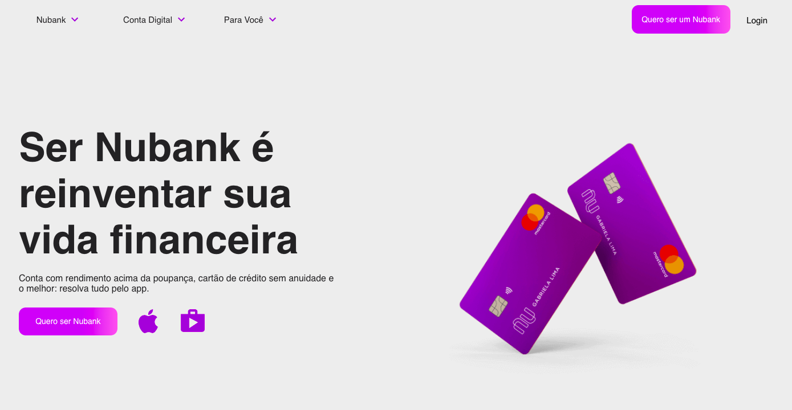
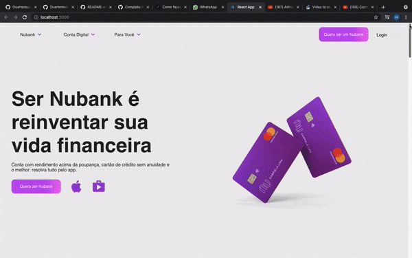

 

<h1 align="center">Nubank Clone</h1>

 <a href="#objetivo">Objetivo</a> • 
 <a href="#autor">Autor</a>

<h1>💻 Sobre o projeto</h1>

 💳  Projeto que tem o intuito de clonar a landingpage  do nubank com o proposito de aprender mais sobre estilização.

<h1>✅ Status do Projeto</h1>

<h4>🚧  Em construção...  🚧</h4>

<h1>🎨 Layout</h1>

<h3>WEB</h3>

 

<h1>🚀  Como executar o projeto</h1>

<h2>Pré-requisitos:</h2>

Antes de começar, você vai precisar ter instalado em sua máquina as seguintes ferramentas: Git, Node.js. Além disto é bom ter um editor para trabalhar com o código como VSCode

<h1>🧭 Rodando a aplicação web (Frontend)</h1>

<h3>Instale as dependências</h3>

\$ npm install

<h3>Execute a aplicação em modo de desenvolvimento</h3>

\$ npm run start

O servidor inciará na porta:3000 - acesse <http://localhost:3000>

<h1>✏️ Autor</h1>

                                                                                                              
<a href="https://github.com/Duartemurilo">duarte Murilo 🌐</a></td>
                                                      
                                                      
